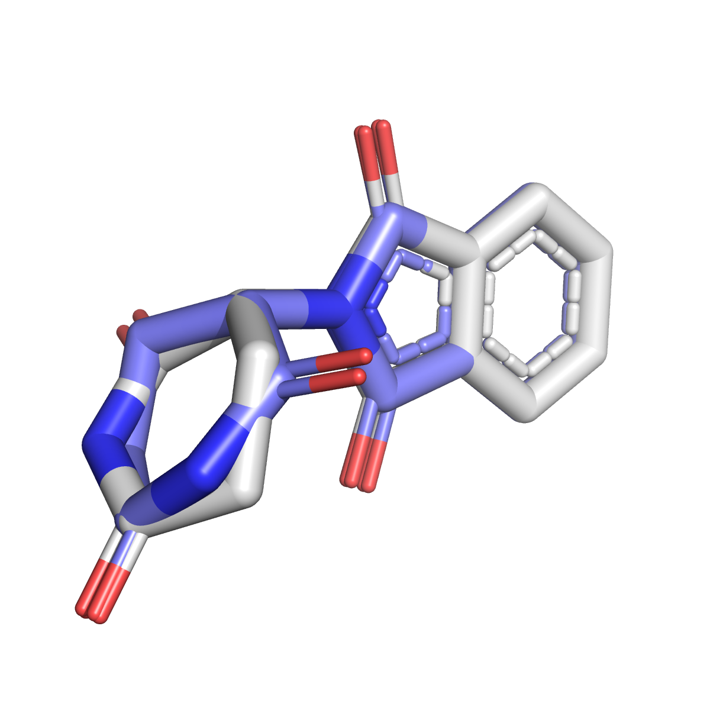

# **MOO 🐮** (Molecule Overlap Optimizer)

  

## Theory

Molecule Overlap Optimizer (MOO 🐮) is a wrapper around RDKit functions to maximize the overlap between two 3D chemical structures. Starting from 2 SMILES representations, MOO generates a set of low-energy conformers using ETKDGv3, converts the conformers to a list of molecules, maximizes the overlap between each structure in the two lists using Open3DAlign and returns the two best overlapping structures in PDB format. An example ouput is shown in the figure below.

<p align="center">
    
    <br>
    <em>Maximized overlap of (+)-Thalidomide and (-)-Thalidomide. MOO returns two separate PDB files, which are then combined to obtain the figure above. </em>
</p>

#### If you find any bugs, have suggestions for improvement or want to contribute to the code, please open a new issue and I will get back to you as soon as possible.

## Getting started

### Prerequisites

You will need following prerequisites: 

* [Python](https://www.python.org)
* [RDKit](https://www.rdkit.org)
* [NumPy](https://numpy.org)
* [scikit-learn](https://scikit-learn.org/stable/)

## Installing MOO 🐮

#### **Installing via pip**

Alternatively, you can pip-install mapchiral on an existing Conda environment as follows:

```console
conda activate my_environment
```

```console
pip install moo-chem
```

## Using MOO 🐮

To use MOO, you only need two SMILES representations of the molecules you want to overlap. The following example shows how to overlap (+)-Thalidomide and (-)-Thalidomide.

```python
from moo import moo

molecule_1 = Chem.MolFromSmiles('C1CC(=O)NC(=O)[C@@H]1N2C(=O)C3=CC=CC=C3C2=O')
molecule_2 = Chem.MolFromSmiles('C1CC(=O)NC(=O)[C@H]1N2C(=O)C3=CC=CC=C3C2=O')

moo.SaveBestOverlapAsPDB(mol1, mol2, nConfs=10, RemoveHs=True, name1='molecule_1', name2='molecule_2')
```
The code generates two PDB files calles molecule_1.pdb and molecule_2.pdb, which contain the two best overlapping structures of the two molecules. The PDB files can easily be combined using PyMol. 

## License
[MIT](https://choosealicense.com/licenses/mit/)

## Contact

 
